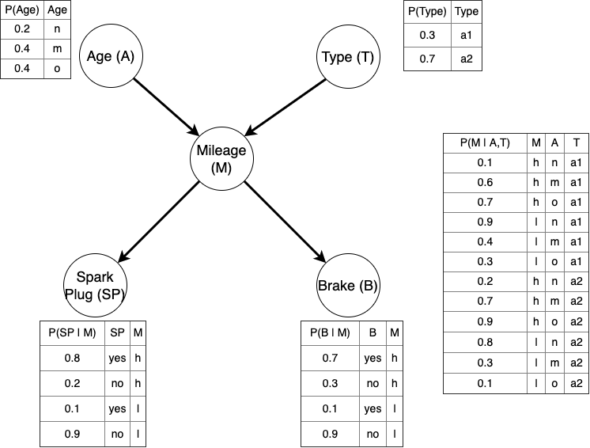

```{r setup, cache = F, echo = F, message = F, warning = F, tidy = F}
# Configuración general de chunks
library(knitr)
options(width = 100)
knitr::opts_chunk$set(echo = F, message = T, error = F, warning = F, comment = NA, dpi = 100, tidy = T, cache.path = '.cache/', fig.path = './figure/', include = F)
```

Como es habitual, cargamos las librerías que necesitamos al inicio del documento.

```{r librerias, message = T, include = T, echo = T}
# Carga de librerías necesarias con pacman
if (!require(pacman)) {
  install.packages("pacman")
  library(pacman)
}
pacman::p_load(readr, stringr, tidyr, dplyr, readxl, ggplot2, forcats, kableExtra, greekLetters, fitdistrplus, OneR, caret, OneR, arules, arulesCBA, arulesViz, Rgraphviz, DescTools, vcd, bnlearn, gRain)
```


# Objetivo

El trabajo consiste en la creación de la *Red Bayesiana* `Garaje` y realizar ejercicios de inferencia. Se hará uso de los paquetes `bnlearn` y `gRain`.

Un taller dispone de una *Red Bayesiana* para modelizar las probabilidades de su día a día. Los vehículos están caracterizados con las variables Edad (A), Tipo (T), Kilometraje (M) y si necesitan cambios de bujías (SP) y/o frenos (B)



# Red Bayesiana

## Distribución de probabilidad

`Escribe de manera **factorizada** la función densidad de probabilidad conjunta P(A,T,M,SP,B)`.

Para hallar la distribución de probabilidad conjunta podemos reescribirla a partir de productos de distribuciones condicionados siguiendo la `regla de la cadena`. Así pues, a partir de la imagen proporcionada se deduce que:

$P(A,T,M,SP,B)= P(A) \times P(T) \times P(M|A, T) \times P(SP | M) \times P(B|M)$

## Grafo Acíclico Dirigido

`Creación del Grafo Acíclico Dirigido`

Vamos a crear el grafo a partir de la función `model2network`.

```{r acyclic_creation, include = T}
nodes <- c("A", "T", "M", "SP", "B")

dag <- model2network("[A][T][M|A:T][SP|M][B|M]", ordering = nodes)
graphviz.plot(dag, shape = "circle")
```

Unas preguntas básicas serían si es acíclico, dirigido y cuáles son los nodos raíz:

```{r basic_questions, include = T}
acyclic(dag)
directed(dag)

root.nodes(dag)
```
Efectivamente, nuestro grafo es acíclico y dirigido (DAG).

El término `dirigido` indica que las aristas tienen una dirección definida, significando que hay una distinción entre el nodo origen y el nodo destino para cada arista. Esto implica que si por ejemplo una arista va del nodo A al B, hay una relación de influencia de A hacia B, pero no necesariamente de B a A.

El término `acíclico` por otra parte indica que noe xisten ciclos, no hay una secuencia de aristas que pueda llevarnos de regreso al mismo nodo siguiendo la dirección de las aristas.

## CPT, Tablas de probabilidad condicionada

En primer lugar, creamos las matrices/arrays de probabilidad condicionada para cada nodo.

```{r creation_cpt, include = T}
# Nodo raíz A
A.lv <- c("n", "m", "o")
A.prob <- array(c(0.2, 0.4, 0.4), dim = 3, dimnames = list(A = A.lv))
A.prob

# Nodo raíz T
T.lv <- c("a1", "a2")
T.prob <- array(c(0.3, 0.7), dim = 2, dimnames = list(T = T.lv))
T.prob

# Nodo M
M.lv <- c("h", "l")
M.prob <- array(c(0.1, 0.9, 0.6, 0.4, 0.7, 0.3, 0.2, 0.8, 0.7, 0.3, 0.9, 0.1), dim = c(2, 3, 2), dimnames = list(M = M.lv, A = A.lv, T = T.lv))
ftable(M.prob, row.vars = c(3, 2), col.vars = 1)

#Nodo SP
SP.lv <- c("yes", "no")
SP.prob <- array(c(0.8, 0.2, 0.1, 0.9), dim = c(2, 2), dimnames = list(SP = SP.lv, M = M.lv))
SP.prob

#Nodo B
B.lv <- c("yes", "no")
B.prob <- array(c(0.7, 0.3, 0.1, 0.9), dim = c(2, 2), dimnames = list(B = B.lv, M = M.lv))
B.prob
```

```{r cpt_showing}
cpt <- list(A = A.prob, T = T.prob, M = M.prob, SP = SP.prob, B = B.prob)
cpt
```

## Red Bayesiana

Unimos el grafo y las distribuciones locales para crear la *Red Bayesiana*. Para ello, utilizamos la función `custom.fit`.

```{r bn_creation, include = T}
bn <- custom.fit(dag, cpt)
bn

graphviz.chart(bn, type = "barprob")
```

# Inferencia 

## junction tree

Creamos el árbol de inferencia `junction tree` para acelerar los cálculos de las probabilidades condicionadas de manera exacta.

El árbol de inferencia proporciona una forma eficiente de realizar estos cálculos al dividir la red bayesiana en subgrafos más pequeños y conectados llamados "cliques", que son conjuntos de nodos completamente conectados entre sí. Estos cliques se combinan de manera jerárquica para formar un árbol, donde cada nodo del árbol representa un clique y cada arista del árbol representa la unión de dos cliques.

```{r jt_creation}
jt <- compile(as.grain(bn))
summary(jt)
```

## Razonamiento sin Evidencias

Determina las probabilidades del Kilometraje de los vehículos, $P(M)$, sin ninguna información adicional (evidencias). ¿Hay algún resultado más esperable que otro?

Matemáticamente, esto sería $P(M) = \sum_{a, t} \ P(M|A, T) \ P(A = a) P (T = t)$.

```{r pM_hand, include = T}
pMh_amano <- (0.1 * 0.3 * 0.2 + 0.6 * 0.3 * 0.4 + 0.7 * 0.3 * 0.4 + 0.2 * 0.7 * 0.2 + 0.7 * 0.7 * 0.4 + 0.9 * 0.7 * 0.4) / (0.1 * 0.3 * 0.2 + 0.6 * 0.3 * 0.4 + 0.7 * 0.3 * 0.4 + 0.2 * 0.7 * 0.2 + 0.7 * 0.7 * 0.4 + 0.9 * 0.7 * 0.4 + 0.9 * 0.3 * 0.2 + 0.4 * 0.3 * 0.4 + 0.3 * 0.3 * 0.4 + 0.8 * 0.7 * 0.2 + 0.3 * 0.7 * 0.4 + 0.1 * 0.7 * 0.4)

pMl_amano <- 1 - pMh_amano

pMh_amano
pMl_amano
```
Obviamente, esto es mucho más cómodo de calcular con la función `querygrain`.

```{r pM_query, include = T}
P_M <- querygrain(jt, nodes = "M", type = "marginal")
P_M
```
Resulta más esperable que tenga un valor de `h` (high) (kilometraje alto) que bajo `l` (low).

Determina las probabilidades del Kilometraje, $M$, cuando la condicionamos al tipo, $T$. ¿observas cambios en los resultados del Kilometraje? 

```{r pM_givenT, include = T}
pM_T <- querygrain(jt, nodes = c("M", "T"), type = "conditional")
pM_T
```
Al condicionar el kilometraje `M` con el tipo de vehículo `T` observamos cambios, puesto que hay una influencia. En ambos tipos de vehículos `a1` y `a2` se da que la categoría más frecuente para `M` es `h`. Sin embargo, puede apreciarse como para el segundo tipo, `a2`, hay un porcentaje más alto de vehículos con `M = h`.


Recupera la distribución de probabilidad CONJUNTA de TODAS las variables del problema. ¿cuál es la situación más probable (MAP)?

```{r p_joint, include = T}
p_joint <- querygrain(jt, type = "joint")
table_joint <- ftable(p_joint)
table_joint
```
```{r max_joint, include = T}
max_value_index <- which.max(table_joint)
max_value <- max(table_joint)

print(paste("El máximo valor de la tabla de probabilidad conjunta es", max_value, ", hallándose en la fila", max_value_index))
```
Un rápido vistazo nos hace ver que esto se da con: $P(A = o, T = a2, M = h, SP = yes, B = yes)$.


## Razonamiento con Evidencias

Determina la probabilidad de la evidencia E={A=n,T=a2,M=l,SP=yes,B=yes}. Interpreta el resultado. *Nota: no es probabilidad marginal.*

```{r evidence_prob, include = T}
evidence <- setEvidence(jt, evidence = list(A = "n", T = "a2", M = "l", SP = "yes", B = "yes"))

pEvidence(evidence)
```
Esta corresponde a la probabilidad de la distribución conjunta dados esos valores particulares.

Determina cómo se modifica la probabilidad de cambiar los frenos, $B=yes$, si sabemos que el vehículo es viejo, $A=o$. ¿Aumenta o disminuye? ¿(según las diapositivas de clase) es razonamiento evidencial o causal?

```{r}

```

Determina cómo se modifica la probabilidad de que el vehículo es nuevo, $A=n$, cuando sabemos que necesita un cambio de bujías y de frenos, $SP=yes, B=yes$. ¿(según las diapositivas de clase) es razonamiento evidencial o causal?

```{r}

```

Determina cómo se modifica la probabilidad de la edad del vehículo, $A$, cuando sabemos que Kilometraje es alto, $SM=h$, dependiendo del tipo de vehículo $TT. 

```{r}

```

